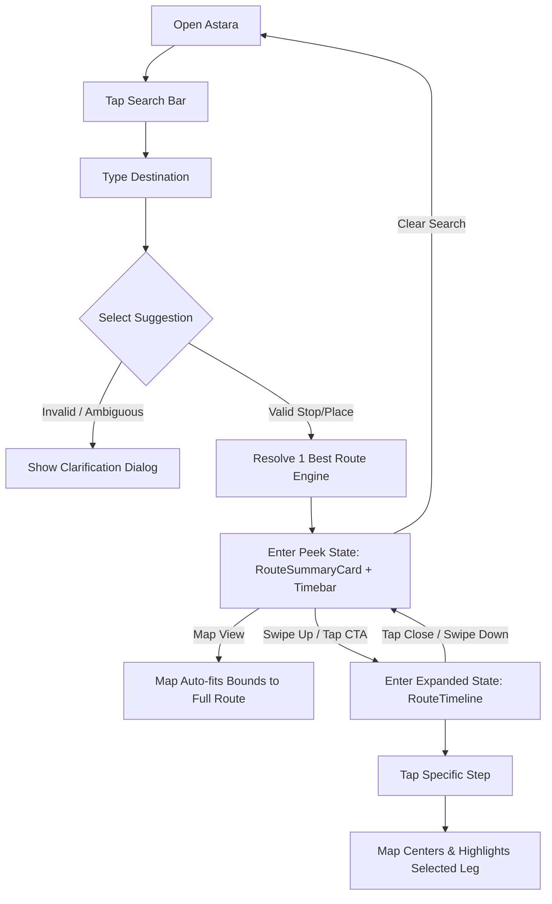

# Information Architecture: Astara

## Site Map & URL Strategy

Astara is structured as a resilient, single-page application (SPA) with deep-linking query parameters for instant state restoration and route sharing.

### URL Patterns

```
/
├── /                                          # Default state: full map + floating search bar
├── /?from={origin_id}&to={destination_id}     # Active route state: locks into 1 Best Route
└── /?from={origin}&to={dest}&step={index}     # Deep-linked step: focuses map on specific leg
```

- **Query Param Invariants:**
  - `from`: Stable GTFS stop ID (e.g., `TJ_1_01`) or URL-encoded name if geocoded.
  - `to`: Stable GTFS stop ID or destination coordinate `lat,lng`.
  - `depart_at`: Optional ISO 8601 timestamp for time-dependent schedule matching.
  - `step`: 0-indexed integer corresponding to active timeline leg.
- **Shareability:** When a route is resolved, the browser URL replaces state (`history.replaceState`) so riders can copy and share the exact itinerary via messaging apps (e.g., WhatsApp).

---

## Navigation Model

The interaction model centers around a **3-State Anchored Bottom Sheet** (Mobile) that translates into a **Fixed Planning Sidebar** (Desktop).

```
┌────────────────────────────────────────────────────────────────────────┐
│                        VIEWPORT CONTAINER                              │
│                                                                        │
│   [ SearchHeader ] (Floating top input)                                │
│   [ MapContainer ] (Full-screen background canvas)                     │
│   [ MapControls  ] (Floating right: Locate Me, Zoom, Layer Reset)      │
│                                                                        │
│   ┌────────────────────────────────────────────────────────────────┐   │
│   │ RouteBottomSheet (Anchored bottom)                             │   │
│   │                                                                │   │
│   │   ├── State 1: Search / Idle (Peek 15%)                        │   │
│   │   │   └── Popular Destination Chips & Nearest Stop             │   │
│   │   │                                                            │   │
│   │   ├── State 2: Route Preview (Peek 35%)                        │   │
│   │   │   └── RouteSummaryCard + ReasonChips + RouteTimebar        │   │
│   │   │                                                            │   │
│   │   └── State 3: Journey Timeline (Expanded 75%)                 │   │
│   │       └── RouteTimeline + StepActionItems + TruthBadges        │   │
│   └────────────────────────────────────────────────────────────────┘   │
└────────────────────────────────────────────────────────────────────────┘
```

---

## Content Hierarchy

### 1. Idle View (Before Route Search)
1. **Primary:** `SearchHeader` with autofocus/tap to open autocomplete.
2. **Secondary:** Quick suggestion chips for high-frequency Jakarta hubs (*Monas, GBK, Blok M, Bundaran HI*).
3. **Tertiary:** Geolocation shortcut to resolve nearest TransJakarta stop.

### 2. Route Preview View (Peek State — 35% Height)
1. **Primary:** Key transit identity (`TJ 1 Arah KOTA`) + Total Journey Duration (`34 mnt`).
2. **Secondary:** One-sentence human rationale (`Paling mudah: 1x transit tanpa nyebrang jalan`).
3. **Tertiary:** Factual `ReasonChips` (`[🛡️ Cuma 1x Pindah]`, `[🚶 280 m Jalan]`) + `RouteTimebar` (segmented horizontal time proportion).
4. **Action:** Prominent expand trigger (`Lihat Langkah Perjalanan ▲`).

### 3. Step-by-Step Timeline View (Expanded State — 75% Height)
1. **Primary:** Ordered vertical steps:
   - *Step 1 (Origin Walk):* Distance/time + Specific entrance gate (`Pintu Utara dekat MRT`).
   - *Step 2 (Boarding & Transit):* Stop name, Platform, Bus Corridor, and **Capitalized Headsign** (`Arah KOTA`).
   - *Step 3 (Intermediate Stops):* Collapsible stop counter accordion (`▾ 6 halte dilewati`).
   - *Step 4 (Transfer Wayfinding):* Physical transfer mechanism (JPO, concourse, platform switch).
   - *Step 5 (Alighting & Exit):* Destination stop + Exit gate direction.
   - *Step 6 (Destination Walk):* Final pedestrian leg to destination.
2. **Secondary:** `TruthBadge` on every physical leg (`Terverifikasi`, `Data terbatas`, `Perlu dicek`).
3. **Tertiary:** Helpful transit tips (e.g., standard Rp 3.500 fare, free internal transfer notice).

---

## User Flows



---

## Naming Conventions (Single Source of Truth Glossary)

To eliminate confusion between technical GTFS specifications and user-facing copy, the following naming dictionary is enforced across all UI layers and documentation:

| Domain Concept | Technical Key (Code) | UI Copy (Bahasa Indonesia) | Prohibited Terms |
|---|---|---|---|
| Transit Stop / Station | `stop` / `station` | **Halte** | Stasiun TJ, Terminal (unless official name) |
| Route / Line Variant | `route` / `service` | **Koridor** (BRT) / **Rute** | Jalur, Trayek |
| Vehicle Direction / Headsign | `headsign` / `direction` | **Arah [TUJUAN]** | Jurusan, Destinasi |
| Transfer / Interchange | `transfer` / `connection` | **Pindah** | Transit (in instructions), Oper |
| Walking Component | `walk_leg` | **Jalan kaki** | Pejalan kaki, Trek jalan |
| Overpass / Skywalk | `footbridge` / `concourse` | **JPO** / **Skywalk** | Jembatan, Penyeberangan |
| Verified Evidence | `verified` | **Terverifikasi** | Pasti, Valid, Terjamin |
| Limited / Unknown Detail | `limited` / `unknown` | **Data terbatas** | Tidak ada data, Error |
| Outdated / Unaudited Data | `stale` / `unreviewed` | **Perlu dicek** | Meragukan, Cek sendiri |
| No Valid Transit Route | `no_route` | **Tidak ada rute** | Gagal, Error 404 |

---

## Component Reuse Map

```
Component: TruthBadge
├── Reused in: StepActionItem (leg-level data honesty indicator)
├── Reused in: RouteSummaryCard (aggregate journey confidence badge)
└── Reused in: HalteDetailModal (stop accessibility audit state)

Component: RouteTimebar
├── Reused in: RouteBottomSheet (Peek State: instant visual summary)
├── Reused in: DesktopSidebar (Top summary section)
└── Reused in: ShareCardModal (Social export preview)

Component: SearchHeader
├── Reused in: Mobile Viewport (Floating pill with backdrop-blur)
└── Reused in: Desktop Viewport (Top input inside left sidebar)
```

---

## Content Growth Plan

1. **Stop Catalog Expansion:** The GTFS index supports >4,000 stops across BRT, Feeders, and Mikrotrans. Autocomplete uses prefix caching and phonetic indexing without bogging down mobile DOM rendering.
2. **Pedestrian Wayfinding Curation:** As community and field audits progress, entrance gates and JPO paths are incrementally added to the dataset. When unverified, the component gracefully falls back to `Data terbatas` without breaking layout hierarchy.
3. **Multi-Variant Routes:** Express routes (e.g., Koridor 13A, 13B) and loop lines (e.g., 9C) are treated with distinct headsign tokens to prevent direction ambiguity.
